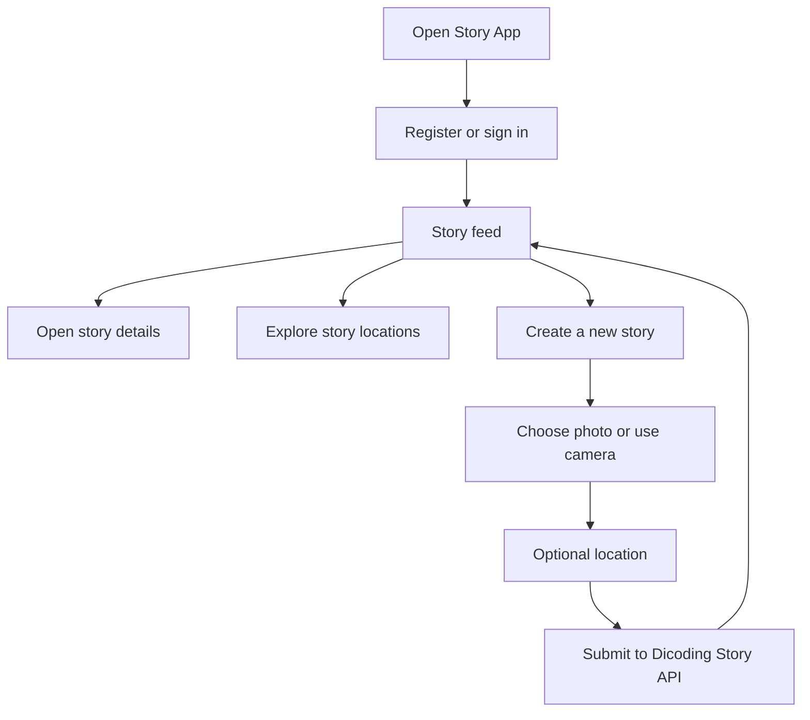
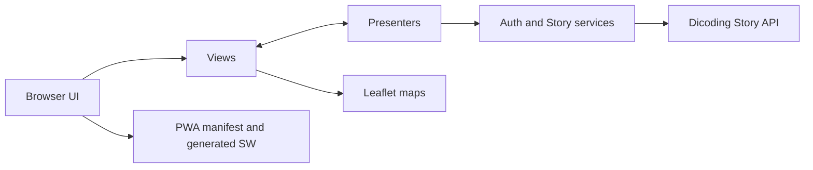

# Story App — Dicoding Story Sharing PWA

**A browser-based story-sharing application built with vanilla JavaScript, a presenter/view architecture, maps, and progressive web app tooling.**

Story App lets registered users browse and publish photo stories, optionally attach a location, and explore location-tagged stories on a map. The frontend integrates with the [Dicoding Story API](https://story-api.dicoding.dev/v1) for user accounts and story data.

> **Repository naming:** this repository is named `notes-app` for historical reasons, but the application implemented here is **Story App**, not a note-taking application. The title follows the actual source code, page metadata, routes, API integration, and PWA manifest.

**Project scope:** educational frontend / Dicoding-style submission, not a verified production social network. Basic PWA asset caching is configured; several offline and notification capabilities are only partially implemented (see [Implementation status and limitations](#implementation-status-and-limitations)).

## The problem and approach

A typical photo-sharing experience involves several connected concerns: registering a user, submitting a photo, associating a location, presenting story data, and keeping the interface usable across mobile and desktop screens.

Story App brings those flows into a lightweight, framework-free frontend. Page presentation is separated from API operations with **views, presenters, and services**, while hash routing allows navigation without a server-side router.

### What you can explore

| Capability | Implementation | Important detail |
| --- | --- | --- |
| Login and registration | Forms backed by Dicoding API endpoints | Token is stored in browser `localStorage` |
| Story feed | Fetches and displays story cards | Requires successful API authentication and network access |
| Story detail | Shows photo, description, author, date, and optional map | Loaded by story ID |
| Create a story | Description and image input; camera capture supported | Posts multipart `FormData` to the remote API |
| Location selection | Browser geolocation / coordinate inputs during story creation | Requires relevant browser permission |
| Story map | Leaflet map with location-tagged story markers | Queries stories with `location=1` |
| Installable web app | Manifest and `vite-plugin-pwa` service-worker generation | Installability must be checked in a production build |
| Offline assets | Workbox-generated precache for built static assets | **Does not guarantee offline story fetching or posting** |
| IndexedDB utilities | Local functions to save/read/delete stories | Utility module exists, but integration with the active story flow is not established |
| Push notification utilities | Subscription helpers and a separate custom service-worker source | End-to-end notification integration is **not verified** |

## How it works



### Application routes

The active Vite entry uses **hash-based navigation**. These are client-side routes under the website root:

| Hash route | Screen |
| --- | --- |
| `#/login` | Login |
| `#/register` | Register |
| `#/` | Story feed |
| `#/stories/:id` | Individual story |
| `#/maps` | Location map |
| `#/add` | Add story |

Other HTML files and a second app-shell implementation are also present in the repository. The primary build entry configured in `vite.config.js` is the **root `index.html`**, so the table above documents that entry rather than assuming every alternate HTML file is included in the deployed build.

## Technology stack

| Layer | Technology |
| --- | --- |
| Frontend | Vanilla JavaScript (ES modules), HTML, CSS |
| UI | Bootstrap 5 and a custom `app-bar` Web Component |
| Routing | Hash-based routing with parameter matching |
| Data/API | Fetch API; Dicoding Story API |
| Maps | Leaflet + map tile providers |
| PWA | Vite 6, `vite-plugin-pwa`, Workbox |
| Browser storage | `localStorage` (session details), IndexedDB helper module via `idb` |
| Interactions | SweetAlert2 and browser media/geolocation APIs |
| Deployment configuration | Netlify settings in `netlify.toml` |

The frontend does not ship its own authentication server or story database.

## Architecture

The main application follows a view/presenter/service separation.



- **Views** render forms, stories, maps, dialogs, and loading/error states.
- **Presenters** coordinate user interactions, validation, requests, and navigation.
- **Services/models** call the Dicoding Story API.
- **Router** maps hash routes to view/presenter pairs.
- **PWA plugin** configures a generated service worker for production asset caching.

### External API

The active code uses `https://story-api.dicoding.dev/v1`.

| Method | Endpoint | Purpose |
| --- | --- | --- |
| `POST` | `/register` | Register user |
| `POST` | `/login` | Obtain login token |
| `GET` | `/stories` | Retrieve story feed |
| `GET` | `/stories/:id` | Retrieve story detail |
| `GET` | `/stories?location=1` | Retrieve stories with coordinates |
| `POST` | `/stories` | Upload a photo story using `FormData` |

The API is an external learning-project service. Availability, credentials, response formats, and acceptable uploads depend on that service.

## Getting started

### Prerequisites

- Node.js and npm compatible with Vite 6.
- Internet access for the Dicoding API and online map tiles.
- A browser with appropriate permissions if testing camera or geolocation.

```bash
git clone https://github.com/alfrzhb/notes-app.git
cd notes-app

npm install
npm run dev
```

The Vite development server is configured to use **port 5176**. Open the URL shown in the terminal (normally `http://localhost:5176`).

Create an account through `#/register` or sign in with an existing valid Dicoding Story API account, then open the story feed or add-story screen.

### Build and preview

```bash
npm run build
npm run preview
```

The build writes static assets to `dist/`. Check the production preview for PWA behavior; development-mode service-worker registration is disabled by the Vite PWA configuration.

**There is no working `npm test` script defined in `package.json`.** An integration test file exists under `src/__tests__/`, but the required Jest/testing-library setup is not declared as an executable test suite in the current package scripts. Do not interpret its presence as a passing automated test run.

## Project structure

```text
index.html                         # Active application entry
vite.config.js                     # Vite input + generated PWA configuration
netlify.toml                       # Netlify build and SPA fallback rules
public/
  manifest.json                    # Static web app manifest
  icons/                           # PWA icon assets
src/
  scripts/
    index.js                       # Bootstrap and initial app setup
    app.js                         # Active app shell, route rendering
    components/app-bar.js          # Custom Web Component
    routes/
      routes.js                    # Hash route table
      url-parser.js                # Route/parameter resolution
    pages/
      auth/                        # Login and registration
      stories/                     # Story feed
      story-detail/                # Story details
      add-story/                   # Photo/camera/location form
      maps/                        # Location map
    services/
      auth-service.js              # Login/register requests
      story-service.js             # Stories API requests
  js/
    db.js                          # IndexedDB utility functions
    notification.js                # Notification subscription helper
    push-notification.js           # Additional push helper
  sw.js                            # Separate custom worker source
  styles/                          # Application CSS
  __tests__/integration/           # Test source (not wired to npm test)
```

## Progressive web app details

The repository has **two distinct service-worker approaches**:

1. `vite.config.js` uses `VitePWA({ strategies: 'generateSW' })`. The production entry imports `virtual:pwa-register` and therefore registers the **generated** worker for built assets.
2. `src/sw.js` contains custom Workbox routes and push event handlers. The current config does **not** select `injectManifest`, so this custom worker should **not** be assumed to be the active production service worker.

In addition, the generated worker's runtime API caching pattern refers to **`api.yourbackend.com`**, while actual story requests target **`story-api.dicoding.dev`**. Consequently, the existing runtime rule does not establish offline caching for the real Story API.

There are also manifest asset references, such as an add-story shortcut icon and screenshot entries, that should be checked against files actually shipped in `dist/`.

**Current claim:** a PWA build and static-asset caching are configured. **Not claimed:** complete offline CRUD, background synchronization, or verified end-to-end push notifications.

## Implementation status and limitations

The code contains the main story views and API service calls, but the following items require review before treating this as a production-ready application:

- **Offline data:** IndexedDB helpers exist but are not proven to be integrated into the active story-feed/posting path; offline story publishing and background sync are not verified.
- **Notifications:** a subscription helper and custom worker handlers exist, but the PWA currently generates its own worker; active push delivery is not established by these files alone.
- **Authentication:** browser-side `localStorage` is used for API tokens; this is an educational implementation, not a hardened session-security architecture.
- **Multiple entry points:** alternative HTML pages and app-shell modules coexist; the build input points only to root `index.html`.
- **Remote dependencies:** API and maps require the availability of outside services.
- **Tests:** test source is present, but no configured `test` package script or verified passing test run is provided.
- **Runtime and accessibility:** photo upload, camera permission, geolocation permission, dynamic HTML rendering, and map keyboard access still warrant browser-level testing.
- **License:** no root `LICENSE` file was found in the inspected tree; an open-source license should not be asserted without an actual license grant.
- **Production:** `netlify.toml` provides a hosting configuration, but this repository inspection does not establish an active production URL.

### Suggested improvement order

1. Consolidate the active application entry and remove or clearly label obsolete duplicate files.
2. Align the PWA manifest and caching patterns with assets and the real Story API.
3. Either integrate `src/sw.js` through an appropriate worker build strategy or remove the unconnected push implementation.
4. Wire IndexedDB into an intentional offline experience if offline stories are an actual product goal.
5. Add an executable automated test setup, integration tests, and build/preview smoke checks.
6. Review token handling, dynamic HTML injection risks, and camera/geolocation accessibility.

---

**Maintainer:** [alfrzhb](https://github.com/alfrzhb) · **Repository:** [alfrzhb/notes-app](https://github.com/alfrzhb/notes-app)

This README documents the current source code and explicitly distinguishes implemented features, auxiliary utilities, and unverified behavior.
